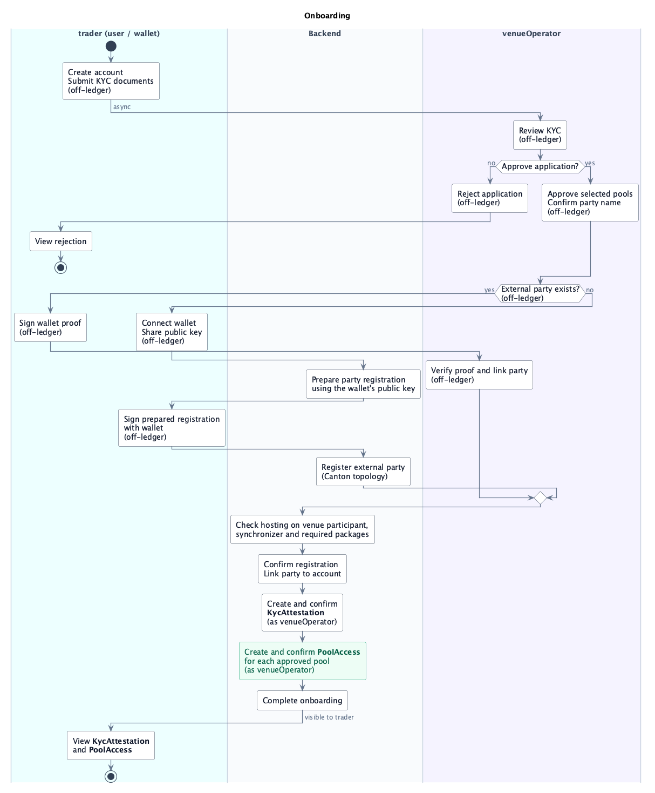

# Onboarding

## `template KycAttestation`

Records that a trader passed the operator's KYC checks for the listed pools.

- **Signatory:** `venueOperator`.
- **Observer:** `trader`.

## `template PoolAccess`

Gives an approved trader visibility of `PoolAccess` and authority to call its choices, following the [Vault Access pattern](https://github.com/Moonsong-Labs/canton-vaults/tree/main/patterns/01-vault-access).
This contract is the pool's API for swap, deposit, and withdrawal requests.

- **Signatory:** `venueOperator`.
- **Observer:** `trader`.

| Choice | Controller | Action |
| --- | --- | --- |
| **`PoolAccess_RequestSwap`** (nonconsuming) | `trader`. | Validates KYC and pool access; creates swap input and receipt allocations. |
| **`PoolAccess_RequestDeposit`** (nonconsuming) | `trader`. | Validates KYC and pool access; creates deposit and LP-token receipt allocations. |
| **`PoolAccess_RequestWithdrawal`** (nonconsuming) | `trader`. | Validates KYC and pool access; locks LP tokens and authorizes receipt of both pool assets through allocations. |

The backend confirms the party's registration before issuing `KycAttestation` and then one `PoolAccess` per approved pool, as `venueOperator`. Onboarding completes after all contracts are confirmed.

