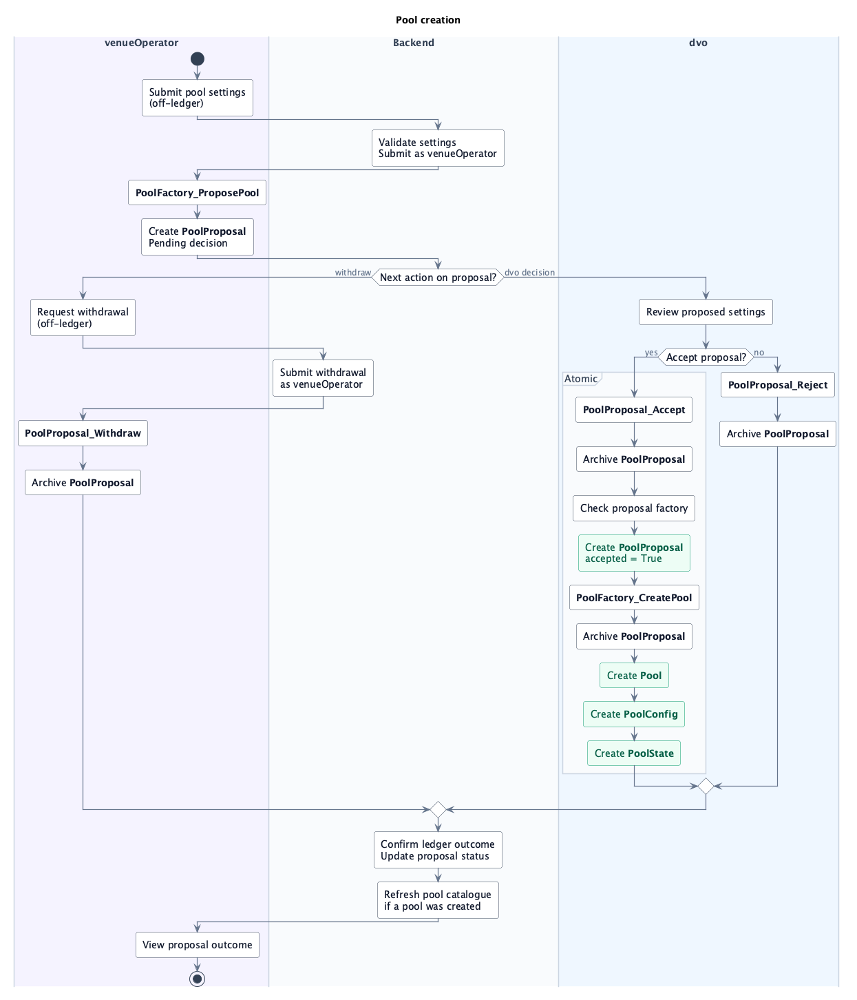
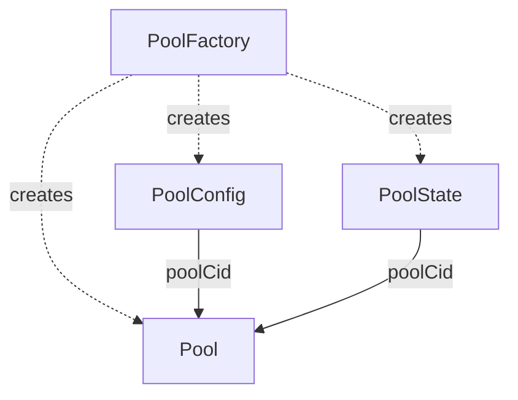

# Pool Creation

## `template PoolProposal`

Stores `venueOperator`'s proposed pool settings and factory reference for `dvo` to accept or reject.

- **Signatory:** `venueOperator`.
- **Observer:** `settings.dvo`.

| Choice | Controller | Action |
| --- | --- | --- |
| **`PoolProposal_Accept`** | `settings.dvo`. | Consumes the proposal, checks the matching factory, and calls `PoolFactory_CreatePool` with the proposed settings. |
| **`PoolProposal_Reject`** | `settings.dvo`. | Consumes the proposal without creating a pool. |
| **`PoolProposal_Withdraw`** | `venueOperator`. | Consumes the proposal without creating a pool. |

## `template PoolFactory`

Creates pools authorized by `dvo`, with their configuration and initial state.

- **Signatory:** `dvo`.
- **Observer:** `venueOperator`.

| Choice | Controller | Action |
| --- | --- | --- |
| **`PoolFactory_ProposePool`** (nonconsuming) | `venueOperator`. | Validates settings and creates `PoolProposal` for `dvo`. |
| **`PoolFactory_CreatePool`** (nonconsuming) | `dvo`. | Validates settings and creates `Pool`, `PoolConfig`, and `PoolState` atomically. |

`dvo` can also call `PoolFactory_CreatePool` directly, without a proposal.

The backend submits proposals and withdrawals as `venueOperator` and tracks confirmed ledger outcomes. `dvo` accepts or rejects proposals.

## Created pool contracts

### `template Pool`

Settles swaps, deposits, and withdrawals for a fixed pair of assets.

- **Signatory:** `dvo`.
- **Observer:** `venueOperator`.
- **Lifecycle:** Created by `PoolFactory_CreatePool`; remains active during
  settlements and configuration changes.

| Choice | Controller | Action |
| --- | --- | --- |
| **`Pool_Swap`** (nonconsuming) | `dvo` and `venueOperator`. | Settles an ordered swap batch and replaces `PoolState` with the final reserves. |
| **`Pool_WithdrawSwap`** (nonconsuming) | `trader`. | Withdraws the trader's unsettled allocations after their settlement deadline. |
| **`Pool_Fund`** (nonconsuming) | `dvo`. | Records initial token backing from existing holdings and replaces `PoolState`. |
| **`Pool_AddLiquidity`** (nonconsuming) | `VENUE_GOVERNANCE`, through `VenueDelegation`. | Settles deposits, mints LP tokens, and replaces `PoolState`. |
| **`Pool_WithdrawLiquidity`** (nonconsuming) | `VENUE_GOVERNANCE`, through `VenueDelegation`. | Burns allocated LP tokens, pays out both assets, and replaces `PoolState`. |

The backend calls `VenueDelegation_SettleBatch` as `venueOperator`; `VenueDelegation` supplies `dvo`'s authorization for `Pool_Swap`.

### `template PoolConfig`

Stores the pool's swap fee.

- **Signatory:** `dvo`.
- **Observer:** `venueOperator`.
- **Lifecycle:** Replaced when `dvo` updates the swap fee.

| Choice | Controller | Action |
| --- | --- | --- |
| **`PoolConfig_Update`** (consuming) | `dvo`. | Validates the new fee and creates a successor with the same pool reference, signatory, and observer. |

### `template PoolState`

Tracks the pool's current reserves and total LP token supply.

- **Signatory:** `dvo`.
- **Observer:** `venueOperator`.
- **Lifecycle:** Replaced by settlement; one successor per swap batch or liquidity
  operation.

No custom choices. The settlement choices on `Pool` archive this contract and
create its successor using the amounts actually settled, minted, or burned.
