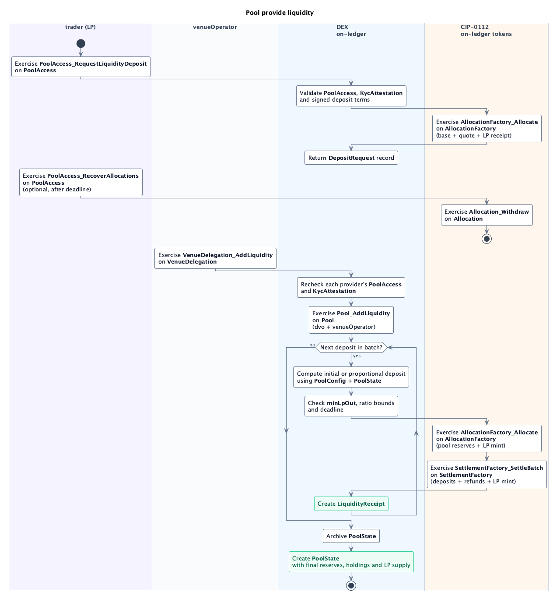

# Pool Provide Liquidity

An approved `trader` supplies liquidity through the `PoolAccess` granted during [onboarding](onboarding.md).

## Request

| Choice | Controller | Action |
| --- | --- | --- |
| **`PoolAccess_RequestLiquidityDeposit`** on `PoolAccess` (nonconsuming) | `trader`. | Checks current access and KYC; allocates base and quote funding and authorizes LP receipt through CIP-0112. |

Returns a **`DepositRequest` record** with the trader, pool, three allocation IDs and signed terms: deposit mode, maximum base and quote amounts, `minLpOut`, ratio bounds and `settlementDeadline`. No LP tokens are minted at request time.

The allocations start without transfer legs: base and quote reserve the maximum amounts, and the LP receipt metadata carries `minLpOut`. Settlement transfers only the accepted deposits, returns unused funding, and mints the full LP output.

## Settlement

| Choice | Controller | Action |
| --- | --- | --- |
| **`VenueDelegation_AddLiquidity`** on `VenueDelegation` (nonconsuming) | `venueOperator`. | Rechecks each provider's `PoolAccess` and `KycAttestation`, then calls `Pool_AddLiquidity` with `dvo`'s authorization. |
| **`Pool_AddLiquidity`** on `Pool` (nonconsuming) | `dvo` and `venueOperator`. | Settles an ordered batch of deposits, refunds and LP mints atomically, checking each request's signed limits against the preceding result. |

- **`InitializeOnly`:** Settles individually using the initial ratio set by `dvo`. Total LP supply is `sqrt(accepted base × accepted quote)`, rounded down to 10 decimals. The trader receives this supply minus `0.0000001` LP, which remains permanently unredeemable and has no holding.
- **`Proportional`:** Uses the current reserves and LP supply. LP issuance rounds down; accepted token amounts round up to their precision. Unused amounts return to the trader.

Each deposit uses the updated reserves, supply and holding IDs from the previous deposit. Settlement consolidates each reserve into one holding in `baseAccount` or `quoteAccount`, creates one receipt per request and replaces `PoolState` once. If any request fails, the whole batch rolls back. The permanent minimum keeps reserves backed after all circulating LP is redeemed; the pool never returns to initialization.

## `template LiquidityReceipt`

Shared with [LP withdrawal](pool-withdraw-liquidity.md). Records the request ID, pool, trader, settlement time and a `LiquidityDeposited` outcome containing accepted amounts, refunds and LP tokens delivered.

- **Signatories:** `dvo` and `venueOperator`.
- **Observer:** `trader`.

## Optional recovery

After `settlementDeadline`, the trader can exercise **`PoolAccess_RecoverAllocations`** on `PoolAccess` to withdraw the remaining allocations through **`Allocation_Withdraw`**. It requires current KYC and `PoolAccess`; allocations already withdrawn directly are omitted.

