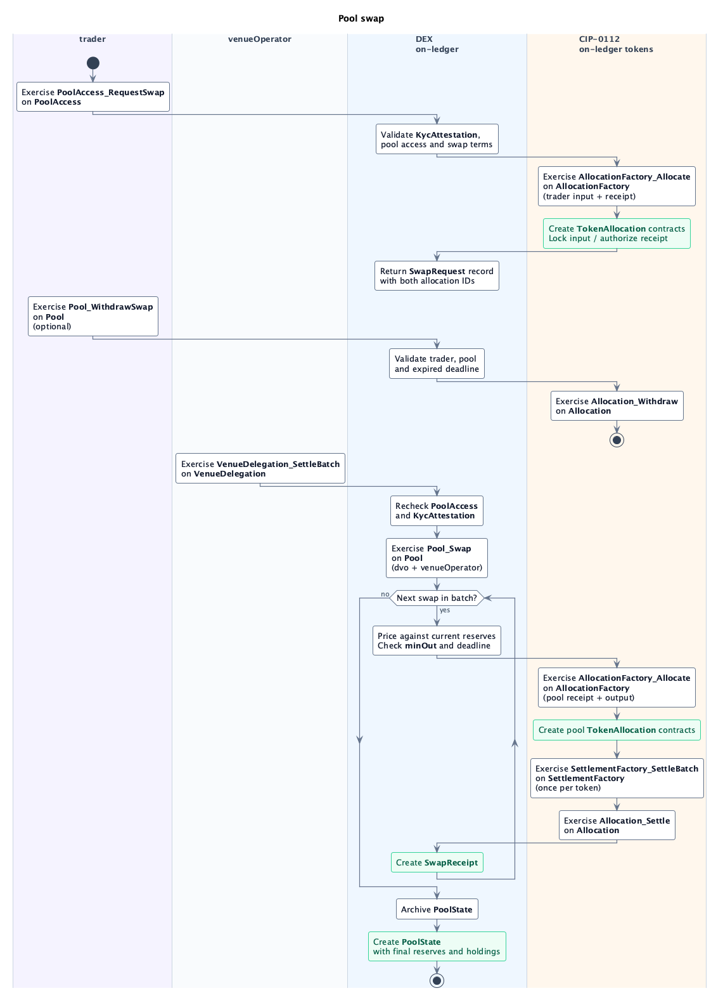

# Pool Swap

An approved `trader` requests a swap through the `PoolAccess` granted during [onboarding](onboarding.md); `venueOperator` later settles it using `dvo`'s authorization through `VenueDelegation`.

## `template VenueDelegation`

Lets the operator settle swaps with the pool authority's permission.

- **Signatory:** `dvo`.
- **Observer:** `venueOperator`.

| Choice | Controller | Action |
| --- | --- | --- |
| **`VenueDelegation_SettleBatch`** (nonconsuming) | `venueOperator`. | Rechecks each trader's access and KYC, then calls `Pool_Swap` with `dvo`'s authorization. |

## `template Pool`

Settles the batch against the current `PoolConfig` and `PoolState`.

- **Signatory:** `dvo`.
- **Observer:** `venueOperator`.

| Choice | Controller | Action |
| --- | --- | --- |
| **`Pool_Swap`** (nonconsuming) | `dvo` and `venueOperator`. | Prices each swap in order, checks `minOut` and the deadline, allocates the pool's legs, and settles both tokens through CIP-0112. |
| **`Pool_WithdrawSwap`** (nonconsuming) | `trader`. | Calls `Allocation_Withdraw` to recover unsettled allocations after `settlementDeadline`. |

The transfers, one `SwapReceipt` per swap, and one replacement `PoolState` for the batch commit atomically.

## `template SwapReceipt`

Records the settled terms, actual output, allocations, and batch reference.

- **Signatories:** `dvo` and `venueOperator`.
- **Observer:** `trader`.

